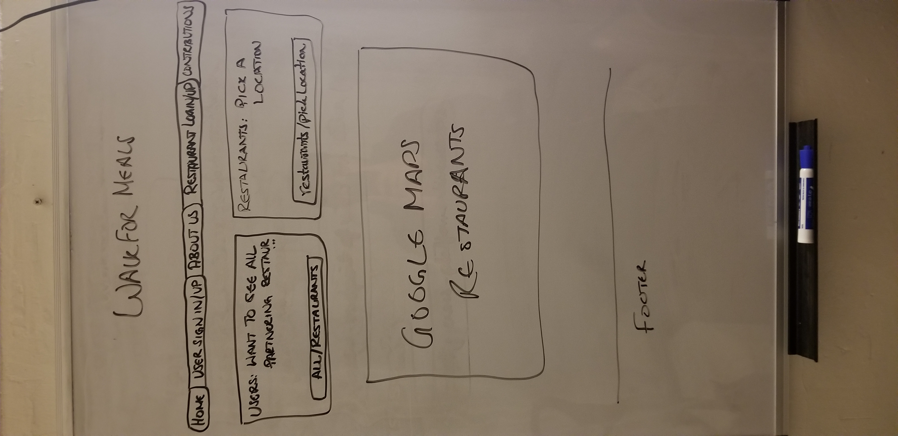
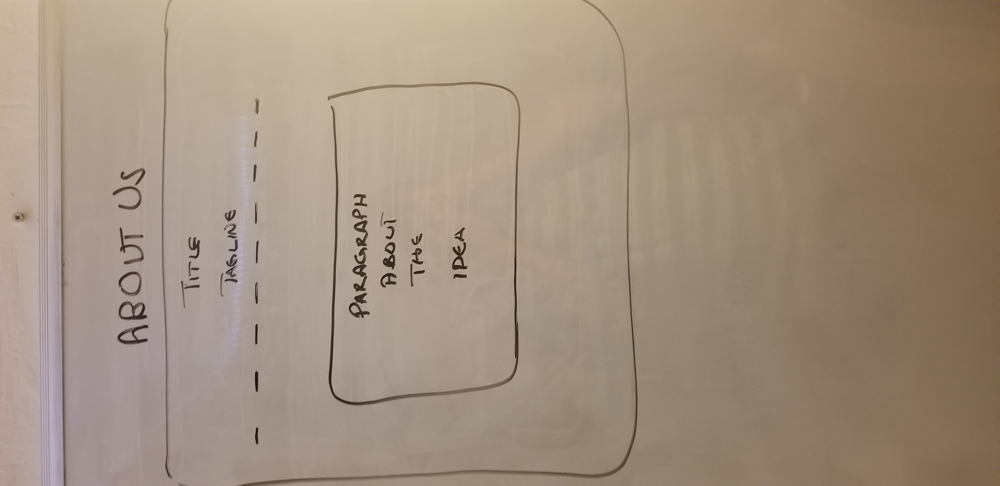
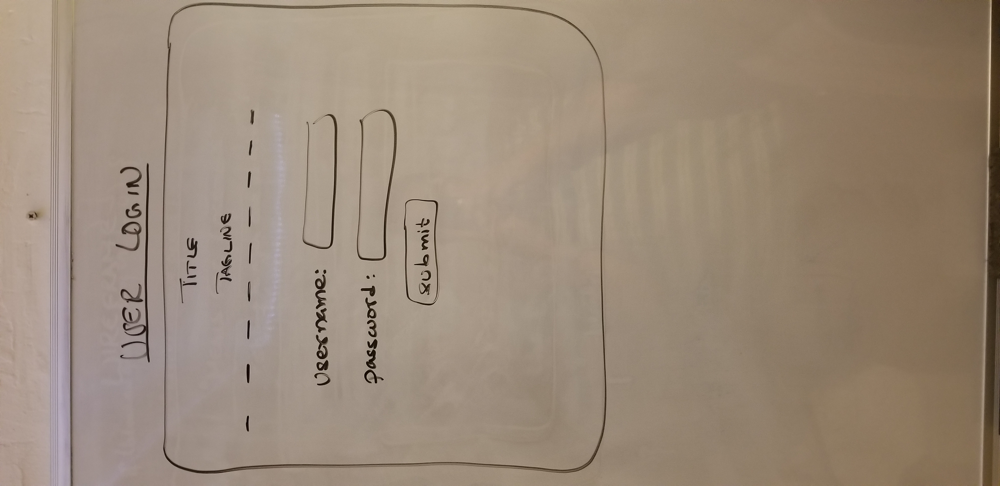
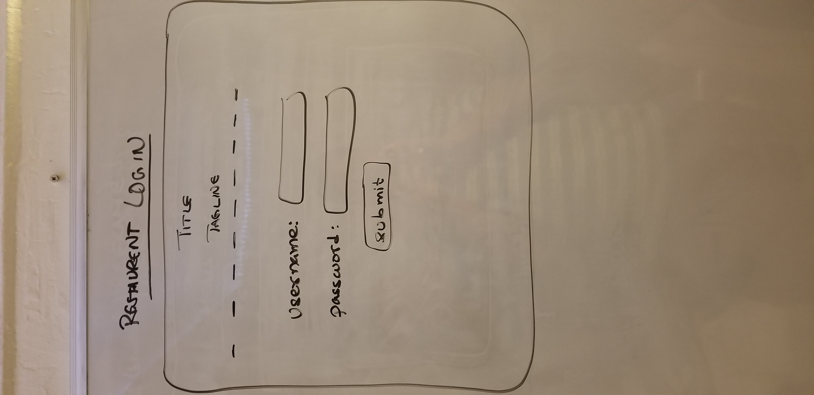
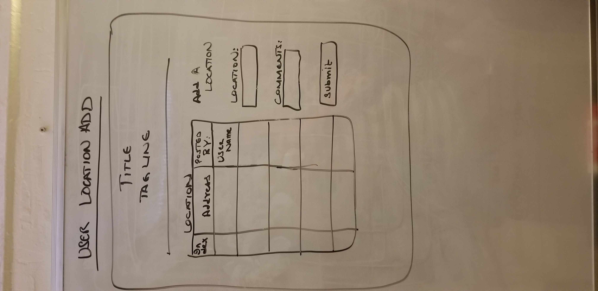
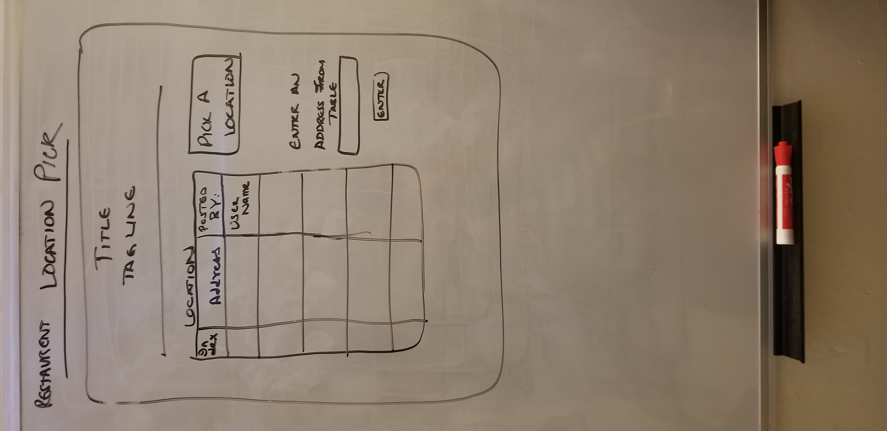

(Title - Walk for Meals)
(Tagline - Fighting hunger on the streets)

## Overview

This web application will partner with restaurents to fight hunger among homeless people. Pedestrians will add the locations of homeless people they encounter on the streets and after 10 commits, they can avail a discount of 10% in any of the partnering
restaurents. Restaurents on the other hand will use the locations provided by pedestrians to identify homeless people in their neighborhood and supply a fixed number of meals to to them throughtout the day.

NOTE: I will be using the word 'user' for 'pedestrian'.

## Data Model

The application will store Users (pedestrians), Restaurents and Location.

* userId and restaurentId for both the collections will be used for referencing the locations (another collection).
* locations will have userId's of a user for referencing. RestaurentId of a restaurent will be added to locations once the restaurent pickups up that location to deliver food.
* discounts will have a userId to reference it to the user who earned the discount. 

An Example User:

```user {
  userId: //generated
  fullName: Lady Gaga
  username: "ladyGaga",
  hash: // a password hash,
  email: ladyGaga@hotmail.com,
  commits: //will get renewed after every 10 commits.    
  totalCommits: //Incrementing on every commit.
}

```restaurent {
  restaurentId: //generated
  restaurentName: 'Bistro Cafe',
  hash: // a password hash,
  email: bistrocafe@gmail.com,
  location:     
  totalDeliveries: //Incrementing on every commit.
}

```location {
  userId: //referencing the user who added this location,
  location: //exact location,
  comments: //additional comments on where the user spotted the homeless people specifically/outfit,
  restaurentId: //added only when restaurent picks the location to deliver food. 
}

```discount {
  userId: //referencing user,
  discountStatus: //either available or availed,
  discountPercent: 10%,
}

```


## [Link to Commented First Draft Schema](db.js) 

(___TODO__: create a first draft of your Schemas in db.js and link to it_)

## Wireframes

/ - Home page 



/about/us - About Us 



/user/login - User login



/restaurent/login - restaurent login 



/user/register - User registration


/restaurent/register - restaurent registeration 


/user/location/add - User location add



/restaurent/location/pick - restaurent location pick 




## Site map


## User Stories or Use Cases

1. as non-registered user or restaurent, I can register a new account with the site.
2. as a user/restaurent, I can log in to the site.
3. as a user/restaurent, I can add a new location OR pick a location (depending on whether user or restaurent).
4. as a user, I can view all of the grocery lists I've created in a single list
5. as a user, I can add items to an existing grocery list
6. as a user, I can cross off items in an existing grocery list

## Research Topics

	* Google Maps API
	* Bootstrap

10 points total out of 8 required points

## [Link to Initial Main Project File](app.js) 

## Annotations / References Used

