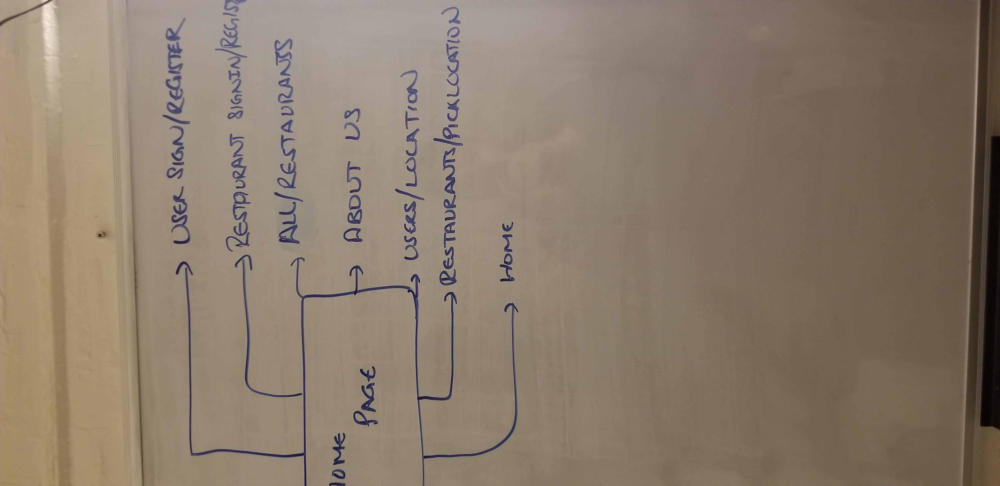

(Title - Walk for Meals)
(Tagline - Fighting hunger on the streets)

## Overview

This web application will partner with restaurents to fight hunger on the streets of New York. Pedestrians will add the locations of homeless people they encounter on the streets. Restaurents on the other hand will use the database provided by pedestrians to deliver fresh food throughtout the day.

NOTE: I will be using the word 'user' for 'pedestrian'.

## Data Model

The application will have the follwing Schemas:
- Users (pedestrians)
- Restaurants
- Location.

There will be no embedded schemas, the objectID will be used to reference each other. Namely, the objectId for users and restaurants.

* locations will have userName of a user for who added the location. Restaurant's userName will be added to locations once the restaurant pickups up that location to deliver food.

An Example User:

```user {
  userId: //generated
  fullName: Lady Gaga
  username: "ladyGaga",
  hash: // a password hash,
  email: ladyGaga@hotmail.com,
  commits: //will get renewed after every 10 commits.    
  totalCommits: //Incrementing on every commit.
}

```restaurant {
  restaurantId: //generated
  restaurantName: 'Bistro Cafe',
  userName: 'bistroCafe'
  hash: // a password hash,
  email: 'bistrocafe@gmail.com',
  location: '123 Freedom Street, NY',    
  totalDeliveries: //Increments on every delivery.
}

```location {
  userName: //referencing the user who added this location,
  location: //exact location,
  comments: //additional comments on where the user spotted the homeless people specifically/outfit,
  restaurantName: //Will be added only when restaurant picks the location to deliver food. 
}

```discount {
  userId: //referencing user,
  discountStatus: //either available or availed,
  discountPercent: 10%,
}

```


## [Link to Commented First Draft Schema](db.js) 

(___TODO__: create a first draft of your Schemas in db.js and link to it_)

## Wireframes

/ - Home page 


/aboutUs - About Us 


/user/signIn-Up - User login-Register


/restaurant/signIn-Up - restaurant/signIn-Up 


/all/restaurants - User all/restaurants


/users/locations - user/locations 


## Site map




## User Stories or Use Cases

1. as non-registered user or restaurant, I can register a new account with the site.
2. as a registered user/restaurant, I can log in to the site.
3. as a registered user/restaurant, I can add a new location OR pick a location respectively.
4. cannot access users/location without signing in.
5. cannot access restaurants/pickLocation without signin in.

## Research Topics

	* Google Maps API
	* Bootstrap
	* Promises

10 points total out of 8 required points

## [Link to Initial Main Project File](app.js)
* http://linserv2.cims.nyu.edu:15181/

## Annotations / References Used
https://developers.google.com/maps/documentation/geocoding/intro
https://www.youtube.com/watch?v=pRiQeo17u6c
